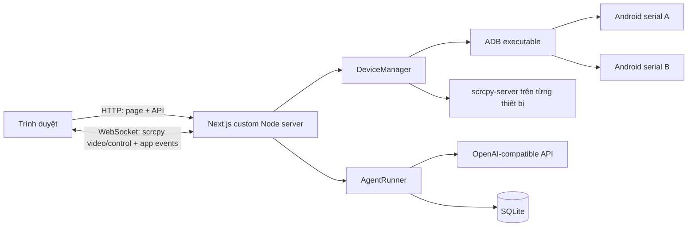
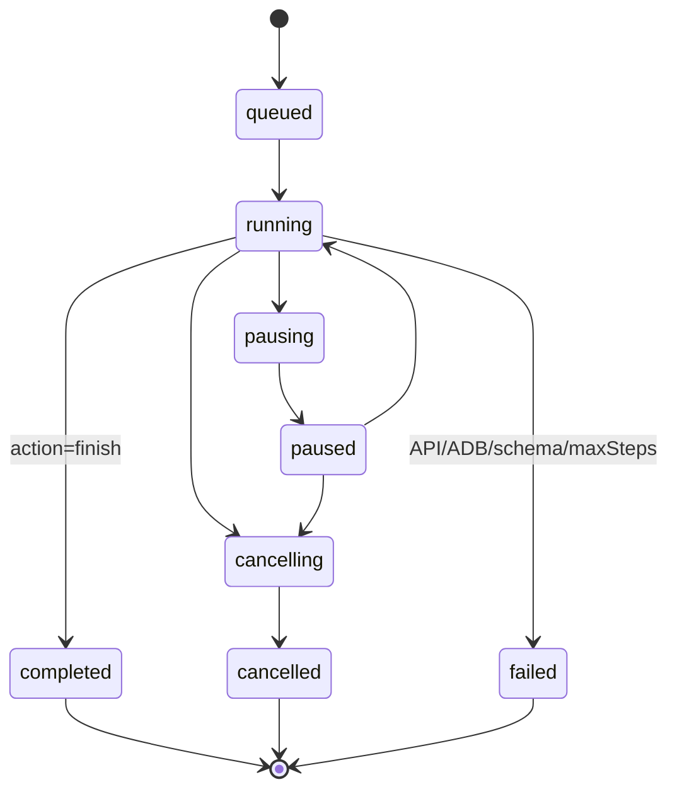

# Kế hoạch chuyển Android Vision Agent sang giao diện web Next.js

## 1. Mục tiêu

Chuyển chương trình dòng lệnh trong `vision_agent.py` thành một ứng dụng web chạy cục bộ trên máy đang kết nối điện thoại Android qua ADB.

Giao diện chính gồm ba vùng cố định:

```text
┌──────────────────┬────────────────────────────────┬──────────────────────┐
│ Menu bên trái    │ Cửa sổ chat ở giữa            │ Màn hình Android     │
│                  │                                │ bên phải             │
│ - Cuộc hội thoại │ - Lịch sử yêu cầu/trạng thái   │ - Ảnh trực tiếp      │
│ - Thiết bị       │ - Tiến trình từng bước         │ - Tap/swipe trực tiếp│
│ - Lịch sử chạy   │ - Ô nhập yêu cầu               │ - Phím Home/Back/... │
│ - Cài đặt        │ - Run/Pause/Stop               │ - Trạng thái ADB     │
└──────────────────┴────────────────────────────────┴──────────────────────┘
```

Ứng dụng cần giữ được toàn bộ năng lực cốt lõi hiện có:

- Phát hiện thiết bị ADB và lấy độ phân giải màn hình.
- Chụp màn hình Android.
- Đọc cây UI từ UIAutomator để tăng độ chính xác khi tap.
- Thực thi `tap`, `swipe`, `text`, `keyevent`, `wait` và `finish`.
- Gửi ảnh, mục tiêu và lịch sử bước cho mô hình vision.
- Kiểm tra phản hồi theo schema trước khi thực thi.
- Giới hạn số bước, dừng tác vụ và ghi log.

## 2. Phạm vi MVP

MVP phục vụ một người dùng trên chính máy Windows đang cắm một hoặc nhiều thiết bị Android. Frontend, HTTP API, agent runner và WebSocket scrcpy nằm trong **một ứng dụng Next.js self-hosted**, chạy bằng một custom Node.js server trên máy có ADB. Không triển khai lên nền tảng serverless vì ADB, scrcpy và các kết nối WebSocket phải truy cập USB/process lâu dài của máy cục bộ.

Trong MVP:

- Combobox liệt kê toàn bộ thiết bị mà ADB nhìn thấy; một thiết bị được chọn để hiển thị và điều khiển tại một thời điểm.
- Một tác vụ AI được chạy tại một thời điểm trên mỗi thiết bị.
- Màn hình điện thoại được stream và điều khiển qua WebScrcpy/ws-scrcpy thay cho vòng lặp screenshot.
- Người dùng có thể gửi mục tiêu bằng chat, theo dõi hành động, dừng tác vụ và điều khiển thủ công.
- Lịch sử chat/tác vụ được lưu cục bộ.
- Cấu hình bí mật chỉ tồn tại ở backend, không gửi xuống trình duyệt.

Ngoài phạm vi MVP:

- Điều khiển thiết bị qua Internet công cộng.
- Nhiều người dùng và phân quyền tổ chức.
- Chạy nhiều agent đồng thời trên cùng một thiết bị.
- Audio mirroring, clipboard hai chiều và file transfer.
- Gửi email kết quả; chức năng này có thể bổ sung sau khi luồng web ổn định.

## 3. Đánh giá code Python hiện tại

| Khối hiện tại | Vai trò | Hướng chuyển đổi |
|---|---|---|
| `DailyLogWriter`, `TeeTextStream` | Log theo ngày | Logger có cấu trúc, ghi file theo ngày và phát sự kiện trạng thái cho UI |
| `load_environment` | Đọc `.env` cạnh script | Biến môi trường chỉ đọc trong server-side Next.js |
| `AgentAction` | Schema hành động | Schema TypeScript + kiểm tra runtime bằng Zod |
| `parse_agent_action` | Tách và kiểm tra JSON | Dùng structured output, vẫn kiểm tra lại trước khi chạy ADB |
| `AndroidController._check_connection` | Kiểm tra ADB | `DeviceManager.listDevices()` và trạng thái kết nối realtime cho combobox |
| `_get_screen_size` | Lấy kích thước thiết bị | Cache theo serial; làm mới khi xoay màn hình |
| `capture_screen_base64` | Chụp, nén JPEG gửi model | Giữ cho snapshot AI; màn hình người dùng chuyển sang video scrcpy/WebSocket |
| `get_clickable_elements` | Dump/parse UIAutomator XML | `UiHierarchyService`, có timeout và cache ngắn |
| `resolve_tap` | Snap tọa độ vào control | Port nguyên thuật toán và viết unit test tương đương |
| `system_keyevent_for_intent` | Ánh xạ Recent Apps | Port sang rule rõ ràng trong `ActionExecutor` |
| `tap/swipe/input_text/keyevent` | Điều khiển ADB | `DeviceControlService`, ưu tiên control channel scrcpy và fallback ADB, luôn khóa theo serial |
| `OpenAIVisionAgent.run_task` | Vòng lặp agent | `AgentRunner` dạng state machine, phát event cho chat |
| CLI `--prompt-file` | Nhận mục tiêu | Tin nhắn người dùng trong cửa sổ chat |
| `send_result_email` | Thông báo sau khi chạy | Để phase sau; UI đã hiển thị kết quả trực tiếp |

Các điểm cần sửa khi chuyển đổi:

- Mọi lệnh ADB phải có `-s <serial>` để không thao tác nhầm khi có nhiều thiết bị.
- Cần queue lệnh theo thiết bị để luồng chụp màn hình, thao tác tay và agent không tranh chấp nhau.
- Serial được gắn cố định vào một run ngay khi bắt đầu; đổi combobox không được chuyển một run đang chạy sang điện thoại khác.
- Vòng lặp hiện tại là đồng bộ và không hủy giữa chừng; bản web phải hỗ trợ `pause`, `resume`, `cancel` bằng `AbortController`.
- Lịch sử hiện chỉ giữ 5 hành động trong RAM; bản web cần lưu session và sự kiện để tải lại trang không mất trạng thái.
- Không nên hiển thị suy luận nội bộ dài của model. Chat chỉ hiển thị mô tả hành động ngắn, kết quả và lỗi hữu ích.
- `adb shell input text` xử lý Unicode/escaping hạn chế; MVP giữ tương thích hiện tại và bổ sung chiến lược nhập Unicode ở phase sau.

## 4. Kiến trúc đề xuất



### 4.1. Một ứng dụng Next.js duy nhất

Ứng dụng gồm hai phần trong cùng codebase và cùng tiến trình khi chạy production:

- **Next.js App Router** render giao diện và cung cấp Route Handlers cho HTTP API.
- **Custom Node server** khởi động Next.js request handler, bắt sự kiện HTTP `upgrade` cho WebSocket và giữ các service chạy lâu dài.

Custom server cần thiết vì kết nối video/control của ws-scrcpy và vòng đời agent không phù hợp với request ngắn hoặc serverless. `npm run dev` và `npm run start` đều khởi động `server.ts`; không có gateway/service thứ hai để người dùng vận hành.

### 4.2. Tích hợp WebScrcpy/ws-scrcpy

Luồng ưu tiên là tích hợp API lập trình của `ws-scrcpy-web`/WebScrcpy vào `AndroidScreen` thay vì nhúng nguyên trang quản trị bằng iframe. Adapter cần che giấu chi tiết thư viện để có thể đổi implementation mà không sửa UI chat:

- `ScrcpySessionManager` dùng ADB để đẩy đúng bản `scrcpy-server` lên thiết bị, tạo tunnel và quản lý socket video/control theo serial.
- `ScrcpyWebSocketServer` multiplex/relay các kênh scrcpy qua WebSocket của custom Node server.
- `ScrcpyPlayer` là Client Component, decode video bằng WebCodecs và render vào `<canvas>` hoặc container do thư viện cung cấp.
- Mouse, touch, keyboard và system key được gửi ngược qua scrcpy control channel.
- `DeviceControlService` là cổng điều khiển duy nhất cho cả thao tác tay và agent; nếu scrcpy session chưa sẵn sàng thì mới fallback sang `adb shell input`.
- Snapshot dành cho model vẫn lấy bằng `adb exec-out screencap -p`, nén JPEG và không đi vòng qua canvas của trình duyệt.

Không tự ghép client và server scrcpy khác phiên bản. Protocol scrcpy là internal và có thể thay đổi; `scrcpy-server`, relay và browser client phải được khóa thành một bộ phiên bản đã test.

Lựa chọn thư viện cần được chốt trong technical spike:

- Ưu tiên kỹ thuật: [`ws-scrcpy-web`](https://github.com/bilbospocketses/ws-scrcpy-web), vì dùng vanilla Genymobile scrcpy-server và có `WsScrcpy.startStream(container, deviceId, options)` để nhúng vào DOM.
- [`NetrisTV/ws-scrcpy`](https://github.com/NetrisTV/ws-scrcpy) chỉ dùng làm tài liệu tham chiếu nếu không chọn fork mới, vì nó dựa trên một scrcpy WebSocket fork cũ.
- Trước khi copy/link mã nguồn phải kiểm tra tương thích giấy phép của lựa chọn cuối cùng với giấy phép dự án này; quyết định đó là cổng chặn trước khi bắt đầu Phase 2.

### 4.3. Các module server-side

- `DeviceManager`: tìm ADB, đọc `adb devices -l`, enrich model/name/status và phát danh sách mới.
- `AdbService`: chạy command theo argument array, luôn nhận serial rõ ràng.
- `ScrcpySessionManager`: một session video/control độc lập cho mỗi serial đang được xem.
- `UiHierarchyService`: dump XML, parse clickable element và tọa độ.
- `DeviceControlService`: validate/serialize tap, swipe, text, keyevent và wait.
- `AgentRunner`: state machine của tác vụ AI, khóa vào serial từ lúc tạo run.
- `ModelClient`: gọi endpoint OpenAI-compatible và kiểm tra structured output.
- `SessionRepository`: lưu conversation, run, step và result vào SQLite.
- `EventBus`: phát device list, selection, run status, action và error.

Các module ADB, scrcpy, database và model phải được đánh dấu server-only và không được import vào Client Component.

### 4.4. Vì sao không gọi ADB từ trình duyệt

Trình duyệt không có quyền chạy process cục bộ hoặc truy cập trực tiếp ADB. API key cũng không được đặt ở client. Toàn bộ device discovery, ADB, scrcpy session và model request vì vậy chạy trong phần server-side của cùng ứng dụng Next.js.

## 5. Thiết kế giao diện

### 5.1. Menu trái

Độ rộng đề xuất: `240–280px`, có thể thu gọn.

- Nút **Cuộc trò chuyện mới**.
- Danh sách conversation gần đây.
- Mục **Thiết bị**: serial, model, trạng thái online/offline.
- Mục **Lịch sử chạy**: success, failed, cancelled.
- Mục **Cài đặt**: model, base URL, max steps, tốc độ refresh; API key chỉ nhập/gửi đến backend và không đọc ngược lại.

### 5.2. Cửa sổ chat giữa

Chiếm toàn bộ phần không gian còn lại sau hai panel.

- Header: tên conversation, thiết bị đang chọn, trạng thái agent.
- Message timeline:
  - Yêu cầu của người dùng.
  - Trạng thái `Đang quan sát`, `Đang thao tác`, `Đang chờ`.
  - Action card gồm số bước, loại action, mô tả ngắn và thời gian.
  - Kết quả cuối hoặc lỗi có hướng xử lý.
- Composer:
  - Ô nhập nhiều dòng.
  - Nút **Chạy**.
  - Trong khi chạy đổi thành **Tạm dừng** và **Dừng**.
  - Cho phép chọn `max steps` trong phần tùy chọn.

Không đưa ảnh base64 vào lịch sử chat. Nếu cần xem lại bước, lưu đường dẫn/snapshot có retention riêng.

### 5.3. Màn hình Android bên phải

Độ rộng đề xuất: `360–460px`, nền tối, giữ đúng aspect ratio thiết bị.

- Combobox **Chọn điện thoại** đặt trên đầu panel, hiển thị tên/model dễ đọc và serial rút gọn.
- Mỗi option có trạng thái `Connected`, `Unauthorized` hoặc `Offline`; option không sẵn sàng không được mở stream.
- Khung màn hình render video realtime từ WebScrcpy/ws-scrcpy, giữ đúng aspect ratio và rotation.
- Hỗ trợ tap, drag để swipe và wheel/trackpad để scroll.
- Thanh phím nhanh: **Back**, **Home**, **Recents**, **Power**, **Volume +/-**.
- Nút refresh device list, reconnect stream, xoay khung hiển thị và chụp snapshot.
- Dòng thông tin tùy chọn: resolution, FPS, bitrate, codec và encoder.
- Overlay tùy chọn để hiện vị trí tap gần nhất và bounds từ UIAutomator.

Quy tắc của combobox:

- Không có thiết bị: placeholder **Không tìm thấy điện thoại**, hiện hướng dẫn bật USB debugging.
- Có đúng một thiết bị `device`: tự chọn và tự mở scrcpy stream.
- Có nhiều thiết bị: khôi phục lựa chọn gần nhất nếu serial còn online; nếu không, yêu cầu chọn rõ ràng, không tự chọn thiết bị đầu tiên.
- Thiết bị `unauthorized/offline` vẫn xuất hiện để người dùng hiểu nguyên nhân nhưng không thể bắt đầu agent.
- Khi chọn serial mới: đóng control/video socket cũ, dọn ADB tunnel cũ, reset player, rồi mới mở session mới.
- Trong lúc run đang hoạt động, combobox bị khóa. Người dùng phải dừng run trước khi đổi thiết bị.
- `run.deviceSerial` là immutable; mọi step và log đều ghi serial đầy đủ.

Quy tắc xung đột:

- Khi agent đang chạy, thao tác trực tiếp mặc định bị khóa.
- Chọn **Điều khiển thủ công** sẽ tạm dừng agent trước khi mở khóa gesture.
- Resume chỉ được thực hiện sau khi chụp lại màn hình và UI hierarchy mới.

### 5.4. Responsive

- Desktop `>= 1200px`: ba cột cùng hiển thị.
- Tablet: menu thu gọn thành icon rail.
- Màn hình hẹp: phone panel mở bằng drawer; chat luôn là vùng chính.
- MVP ưu tiên desktop vì ADB chạy tại máy phát triển/vận hành.

## 6. Luồng dữ liệu chính

### 6.1. Kết nối thiết bị

1. Next.js custom server kiểm tra `adb` khi khởi động.
2. `DeviceManager` chạy `adb devices -l` khi load trang, khi user refresh và theo chu kỳ/poll hoặc ADB tracker.
3. Backend chuẩn hóa mỗi item thành `{ serial, name, model, product, transportId, state }`.
4. Combobox nhận danh sách mới nhưng giữ selection theo `serial`, không theo index.
5. Khi chọn thiết bị, server lấy screen metadata và tạo scrcpy session dành cho serial đó.
6. Khi rút cáp, server dừng run của đúng serial, đóng scrcpy session và phát `device.disconnected`.
7. Nếu thiết bị xuất hiện lại, combobox cập nhật trạng thái nhưng không tự resume run đã dừng.

### 6.2. Stream màn hình

1. `ScrcpySessionManager` khóa session theo serial và khởi động matching `scrcpy-server` trên thiết bị.
2. Server tạo ADB tunnel/socket cho video và control, sau đó relay/multiplex qua WebSocket.
3. `ScrcpyPlayer` trong browser nhận encoded video, decode bằng WebCodecs và render frame mới nhất.
4. Pointer/touch/keyboard event đi ngược qua control channel của đúng session/serial.
5. Khi WebSocket rớt, UI hiển thị `Reconnecting`; reconnect luôn xác minh serial vẫn còn ở trạng thái `device`.
6. Khi user đổi combobox, session cũ phải được teardown hoàn toàn trước khi session mới nhận input.
7. Ảnh gửi model là snapshot ADB riêng, nén JPEG quality gần với bản Python hiện tại; video packet không được đưa trực tiếp vào prompt.

MVP mặc định video-only để giảm độ phức tạp; audio có thể mở ở phase sau nếu thực sự cần.

### 6.3. Chạy một yêu cầu chat

1. User gửi mục tiêu.
2. Backend tạo `run` ở trạng thái `queued` rồi chuyển `running`.
3. Mỗi bước:
   - Chụp snapshot mới.
   - Lấy clickable controls từ UIAutomator.
   - Ghép mục tiêu + tối đa 5 action gần nhất + ảnh.
   - Gọi model và parse `AgentAction`.
   - Validate action và giới hạn tọa độ/keycode/duration.
   - Nếu `finish`, lưu kết quả và kết thúc.
   - Nếu chưa xong, thực thi qua ADB, lưu step, phát event và đợi UI ổn định.
4. UI thêm action card vào chat ngay khi nhận event.
5. Nếu đạt `maxSteps`, run kết thúc với trạng thái `failed/max_steps`.

### 6.4. Dừng tác vụ

1. User nhấn **Dừng**.
2. Backend chuyển run sang `cancelling` và kích hoạt abort signal.
3. Request model/capture/wait hiện tại bị hủy nếu có thể.
4. Không thực thi action mới sau thời điểm cancel.
5. Backend lưu `cancelled` và UI mở lại điều khiển thủ công.

## 7. State machine của AgentRunner



Chỉ `running` mới được phát lệnh action. Mỗi transition được lưu và có timestamp để UI có thể phục hồi trạng thái sau reload.

## 8. API và event contract

### 8.1. HTTP API

| Method | Endpoint | Mục đích |
|---|---|---|
| `GET` | `/api/health` | Kiểm tra Next.js server, ADB, scrcpy asset và database |
| `GET` | `/api/devices` | Liệt kê thiết bị và trạng thái |
| `POST` | `/api/devices/:serial/select` | Chọn thiết bị cho session |
| `GET` | `/api/devices/:serial/snapshot` | Lấy một ảnh PNG hiện tại |
| `GET` | `/api/devices/:serial/ui` | Lấy clickable elements để debug overlay |
| `POST` | `/api/devices/:serial/stream` | Chuẩn bị/start scrcpy session và trả stream metadata |
| `DELETE` | `/api/devices/:serial/stream` | Dừng session và dọn tunnel/socket |
| `POST` | `/api/devices/:serial/actions` | Điều khiển thủ công sau khi validate |
| `GET` | `/api/conversations` | Danh sách conversation |
| `POST` | `/api/conversations` | Tạo conversation |
| `GET` | `/api/conversations/:id` | Lấy messages và run hiện tại |
| `POST` | `/api/conversations/:id/runs` | Gửi goal và bắt đầu run |
| `POST` | `/api/runs/:id/pause` | Tạm dừng run |
| `POST` | `/api/runs/:id/resume` | Tiếp tục run |
| `POST` | `/api/runs/:id/cancel` | Dừng run |

Contract tối thiểu cho combobox:

```ts
type DeviceSummary = {
  serial: string;
  state: "device" | "unauthorized" | "offline";
  model: string | null;
  product: string | null;
  device: string | null;
  transportId: string | null;
  displayName: string;
};
```

`serial` là value duy nhất của option. Nhãn gợi ý: `Samsung SM-S921B · R5CX… · USB`; không dùng model làm key vì nhiều máy có thể cùng model.

Ví dụ body điều khiển thủ công:

```json
{
  "type": "tap",
  "x": 512,
  "y": 438
}
```

Tọa độ API luôn chuẩn hóa `0..1000`; backend mới chuyển sang pixel thực để cùng quy ước với agent.

### 8.2. WebSocket

Custom Node server xử lý hai namespace trên cùng origin:

- `/ws/scrcpy?serial=<serial>&session=<token>` cho binary video/control protocol của WebScrcpy/ws-scrcpy.
- `/ws/events?conversationId=<id>` cho event nghiệp vụ của chat và agent. Nếu không cần giao tiếp hai chiều, namespace event có thể dùng SSE nhưng không thay đổi contract.

Stream token là token ngắn hạn do endpoint start stream cấp, bị ràng buộc với serial và browser session. Server không chấp nhận serial chỉ dựa vào payload WebSocket của client.

Event JSON:

- `devices.changed`
- `device.selected`
- `device.status`
- `stream.status`
- `run.status`
- `run.step.started`
- `run.step.action`
- `run.completed`
- `run.failed`
- `run.cancelled`
- `system.error`

Video/control binary phải tuân theo đúng protocol của adapter ws-scrcpy đã khóa phiên bản, không tự định nghĩa một format frame song song. Event nghiệp vụ cần có `eventId`; client bỏ qua event trùng và có thể gọi HTTP để đồng bộ lại sau reconnect.

### 8.3. Schema hành động

Giữ tương thích với Python trong phase đầu:

```ts
type AgentAction = {
  action: "tap" | "swipe" | "text" | "keyevent" | "wait" | "finish";
  thought: string;
  x: number | null;
  y: number | null;
  x2: number | null;
  y2: number | null;
  duration_ms: number | null;
  text: string | null;
  keycode: number | null;
};
```

Sau khi đạt parity có thể đổi `thought` thành `summary` để diễn đạt đúng nội dung được phép hiển thị trên UI. Backend không tin dữ liệu model dù structured output đã hợp lệ; action vẫn phải qua whitelist và kiểm tra biên.

## 9. Cấu trúc source đề xuất

```text
android_automation_aiagent/
├─ app/                            # Next.js App Router
│  ├─ api/
│  │  ├─ devices/
│  │  ├─ conversations/
│  │  └─ runs/
│  ├─ conversations/[id]/page.tsx
│  ├─ layout.tsx
│  └─ page.tsx
├─ components/
│  ├─ sidebar/
│  ├─ chat/
│  └─ device/
│     ├─ device-combobox.tsx
│     ├─ android-screen.tsx
│     └─ scrcpy-player.tsx
├─ lib/
│  ├─ contracts/                   # DTO/schema dùng chung client/server
│  ├─ client/
│  │  └─ scrcpy-client-adapter.ts
│  └─ server/                      # Tất cả module trong đây là server-only
│     ├─ adb/
│     │  ├─ adb-service.ts
│     │  ├─ device-manager.ts
│     │  └─ ui-hierarchy.ts
│     ├─ scrcpy/
│     │  ├─ scrcpy-session-manager.ts
│     │  ├─ scrcpy-ws-server.ts
│     │  └─ device-control-service.ts
│     ├─ agent/
│     │  ├─ agent-runner.ts
│     │  ├─ action-schema.ts
│     │  ├─ prompt-builder.ts
│     │  └─ tap-grounding.ts
│     ├─ model/model-client.ts
│     └─ persistence/
├─ vendor/
│  └─ scrcpy-server               # Bản matching với adapter, có checksum/license
├─ data/                           # SQLite, không commit
├─ logs/                           # Log runtime, không commit
├─ docs/
├─ server.ts                       # HTTP + Next handler + WebSocket upgrades
├─ vision_agent.py                 # Bản đối chiếu trong thời gian migrate
└─ package.json                    # Một app, một bộ dev/build/start scripts
```

Đây là một dự án Next.js duy nhất. `server.ts` chỉ bổ sung lifecycle/WebSocket cho Next.js, không phải một backend app được deploy riêng.

## 10. Dữ liệu lưu cục bộ

Các bảng tối thiểu:

- `conversations(id, title, device_serial, created_at, updated_at)`
- `messages(id, conversation_id, role, content, created_at)`
- `runs(id, conversation_id, goal, status, max_steps, error_code, result, started_at, ended_at)`
- `run_steps(id, run_id, step_no, action_json, summary, duration_ms, created_at)`
- `settings(key, value, updated_at)` cho cấu hình không bí mật

Không lưu API key trong SQLite. Snapshot chỉ lưu khi bật tùy chọn debug; cần giới hạn số lượng/dung lượng và có nút xóa.

## 11. Lộ trình triển khai

### Phase 0 — Chốt baseline và test parity

Mục tiêu: đóng băng hành vi đúng của Python trước khi port.

Công việc:

- Tách các sample input/output không chứa dữ liệu nhạy cảm.
- Viết test cho schema action, chuẩn hóa tọa độ, `resolve_tap` và intent Recent Apps.
- Ghi lại lỗi ADB chuẩn: missing binary, no device, unauthorized, offline, multiple devices.
- Quyết định biến môi trường và tạo `.env.example` không có secret.

Tiêu chí hoàn thành:

- Có bộ test làm chuẩn cho thuật toán grounding.
- Có checklist thao tác Python thành công trên thiết bị thật.

### Phase 1 — Khởi tạo Next.js custom server và quản lý thiết bị

Mục tiêu: điều khiển ADB qua API mà chưa cần AI/chat.

Công việc:

- Tạo một Next.js app, `server.ts`, Route Handlers và contract dùng chung.
- Implement device discovery, screen size, model/name và error mapping.
- Xây combobox theo serial với trạng thái loading/empty/unauthorized/offline/multiple devices.
- Implement action validator/executor với serial bắt buộc.
- Implement screenshot endpoint và health endpoint.
- Thêm command queue theo serial, timeout và giới hạn kích thước input.

Tiêu chí hoàn thành:

- Combobox hiển thị đúng mọi thiết bị và giữ selection theo serial khi danh sách đổi thứ tự.
- Trường hợp một thiết bị tự chọn đúng; nhiều thiết bị không tự thao tác nhầm máy.
- Tap, swipe, Back, Home, Recents chạy đúng trên thiết bị đã chọn.
- Không có đường API nào cho phép truyền command shell tùy ý.

### Phase 2 — Tích hợp WebScrcpy/ws-scrcpy và giao diện ba cột

Mục tiêu: có UI đúng yêu cầu và điều khiển thủ công mượt.

Công việc:

- Xây sidebar, chat shell và phone panel.
- Làm technical spike để chốt adapter, phiên bản scrcpy-server và giấy phép.
- Tích hợp player API vào Client Component, không nhúng nguyên UI quản trị.
- Thêm WebSocket upgrade/lifecycle, stream token, reconnect và status badge trong `server.ts`.
- Stream video scrcpy, decode WebCodecs và render đúng aspect ratio/rotation.
- Map tap/drag/wheel/keyboard vào scrcpy control channel của serial đang chọn.
- Teardown session/tunnel đúng thứ tự khi đổi combobox hoặc disconnect.
- Khóa/manual takeover khi agent đang chạy.

Tiêu chí hoàn thành:

- Ba vùng hiển thị đúng trên desktop.
- Video scrcpy hiển thị realtime; UI có FPS/resolution/codec và báo lỗi decoder rõ ràng.
- Tap tại bốn góc và tâm sai lệch không quá ngưỡng test đã định.
- Đổi qua lại ít nhất hai thiết bị không gửi input nhầm serial và không để tunnel/socket cũ.
- Rút/cắm lại USB không làm web crash.

### Phase 3 — Port AgentRunner và tích hợp chat

Mục tiêu: gửi một goal từ chat và agent tự điều khiển đến khi hoàn tất.

Công việc:

- Port schema, prompt, history window, grounding và action loop.
- Tích hợp model client bằng cấu hình server-side.
- Phát step/action/status event ra chat.
- Thêm max steps, pause, resume, cancel và timeout.
- Khi resume, luôn chụp snapshot/UI hierarchy mới.
- Ẩn dữ liệu nhạy cảm và không log ảnh/base64 hoặc API key.

Tiêu chí hoàn thành:

- Các tác vụ baseline cho kết quả tương đương Python.
- Reload trang vẫn xem được run và không khởi chạy trùng.
- Cancel đảm bảo không có action mới được gửi sau khi xác nhận dừng.

### Phase 4 — Persistence, lịch sử và settings

Mục tiêu: hoàn thiện menu trái và khả năng khôi phục phiên.

Công việc:

- Thêm SQLite migrations/repository.
- Lưu conversation, messages, run và step.
- Tạo màn hình lịch sử, đổi tên/xóa conversation.
- Thêm setting model/base URL/max steps/fps.
- Thêm retention cho log và snapshot debug.

Tiêu chí hoàn thành:

- Restart ứng dụng không mất lịch sử.
- Settings được validate và secret không trả về client.

### Phase 5 — Hardening và đóng gói local

Mục tiêu: người dùng khởi động tin cậy trên Windows.

Công việc:

- Thêm startup preflight: Node, ADB, port, database, model config.
- Thêm error boundary, empty/loading state và thông báo cách sửa lỗi.
- Viết unit, integration và browser end-to-end test.
- Đóng gói một script chạy Next.js custom server và shutdown graceful.
- Viết hướng dẫn cài đặt USB debugging, ADB authorization và vận hành.

Tiêu chí hoàn thành:

- Một lệnh khởi động toàn bộ ứng dụng Next.js.
- Pass toàn bộ test và checklist trên ít nhất hai độ phân giải/orientation.
- Không để lại scrcpy-server, ADB tunnel/socket hoặc model request treo sau khi thoát.

### Phase 6 — Tối ưu sau MVP

Chỉ làm khi số liệu MVP cho thấy cần thiết:

- Hỗ trợ nhiều thiết bị song song với worker riêng theo serial.
- Bật audio scrcpy và lựa chọn codec/bitrate/quality nâng cao.
- Nhập Unicode/IME ổn định.
- Snapshot timeline và replay run.
- Gửi email/webhook khi hoàn tất.
- Authentication nếu mở ứng dụng ra ngoài localhost.

## 12. Chiến lược kiểm thử

### Unit test

- Parse/validate mọi biến thể `AgentAction`.
- Reject tọa độ ngoài `0..1000`, keycode không whitelist và duration quá lớn.
- Chuyển tọa độ khi portrait, landscape và có letterbox.
- Port test cho `normalize_match_text`, `resolve_tap`, semantic/spatial snapping.
- State transition của run, đặc biệt pause/cancel tại từng điểm await.

### Integration test

- Mock process runner thay vì gọi ADB thật trong CI.
- Fixture cho `adb devices -l`, `wm size` và UIAutomator XML.
- Fixture cho hai thiết bị trùng model nhưng khác serial; verify chọn/route theo serial.
- Model fake trả lần lượt tap/text/wait/finish hoặc malformed response.
- Kiểm tra queue đảm bảo action không chạy song song sai thứ tự.
- Kiểm tra matching client/server protocol, reconnect WebSocket và đồng bộ event bị lỡ.
- Kiểm tra cleanup scrcpy session/tunnel khi switch, disconnect và shutdown.

### End-to-end trên thiết bị thật

- Kết nối/authorize/rút/cắm lại USB.
- Kết nối đồng thời ít nhất hai điện thoại, đổi combobox và xác minh hình/input đúng máy.
- Tap icon, nhập text, swipe list, Back/Home/Recents.
- Xoay màn hình trong lúc stream và trong lúc agent chạy.
- Cancel ngay trước/sau model response.
- Tác vụ kết thúc success, max steps và API failure.

## 13. Bảo mật và giới hạn an toàn

- Next.js custom server mặc định chỉ bind `127.0.0.1`.
- API key/model credentials chỉ nằm trong biến môi trường server-side.
- Không nhận chuỗi ADB command từ client; client chỉ gửi action theo schema đóng.
- Whitelist keyevent và giới hạn text length, swipe duration, request rate.
- Escape argument bằng API spawn argument array, không ghép chuỗi shell.
- Mọi action gắn với serial đang được session sở hữu.
- Không log secret, base64 image hoặc nội dung nhạy cảm theo mặc định.
- Stream WebSocket phải kiểm tra origin, host và token ngắn hạn gắn với serial.
- Có nút dừng rõ ràng và kill switch ở server.
- Nếu sau này expose qua LAN/Internet, bắt buộc thêm authentication, TLS, CSRF/origin policy và authorization theo thiết bị trước khi mở port.

## 14. Rủi ro và cách giảm thiểu

| Rủi ro | Tác động | Giảm thiểu |
|---|---|---|
| Client và scrcpy-server lệch phiên bản | Không mở được video/control | Pin cùng một bộ version/checksum và test protocol trước khi nâng cấp |
| Trình duyệt không hỗ trợ codec/WebCodecs | Phone panel không phát video | Probe capability, ưu tiên H.264 và báo fallback/browser requirement rõ ràng |
| Custom server bị restart/hot reload | Stream hoặc run bị ngắt | Server là nguồn trạng thái, cleanup/reconnect idempotent và lưu run vào SQLite |
| Đổi thiết bị nhưng socket cũ còn sống | Input nhầm điện thoại | Selection/run khóa theo serial, teardown có await và stream token theo serial |
| Nhiều lệnh tranh chấp cùng thiết bị | Tap sai trạng thái | Queue/lock theo serial và manual takeover có pause |
| Model trả action không hợp lệ | Điều khiển ngoài ý muốn | Structured output + runtime validation + whitelist |
| Sai tọa độ khi resize/xoay | Tap lệch | Chuẩn hóa 0..1000, trừ letterbox, refresh screen metadata |
| UIAutomator dump chậm/không có node | Tăng latency/giảm grounding | Timeout, cache ngắn và fallback về vision coordinate |
| ADB text không hỗ trợ tốt Unicode | Nhập tiếng Việt lỗi | Tài liệu hóa giới hạn MVP; thêm IME strategy phase sau |
| Reload tạo run trùng | Hai agent cùng thao tác | Run id bền vững, server là nguồn trạng thái duy nhất |
| Lộ API key qua bundle/log | Sự cố bảo mật | Server-only env, redaction test, không có public env cho secret |
| Giấy phép thư viện ws-scrcpy không phù hợp | Không thể phân phối sản phẩm như dự kiến | Review license trước khi copy/link code; giữ adapter để thay implementation |

## 15. Definition of Done cho MVP

MVP được coi là hoàn tất khi:

- Giao diện desktop có menu trái, chat giữa và màn hình Android bên phải.
- Combobox liệt kê đúng nhiều thiết bị ADB, chọn theo serial và xử lý rõ empty/unauthorized/offline.
- Màn hình Android được phát qua WebScrcpy/ws-scrcpy và hỗ trợ điều khiển tap/swipe/keyboard/phím hệ thống.
- Đổi thiết bị đóng sạch session cũ và không có thao tác nào đi nhầm serial.
- Người dùng gửi goal từ chat; agent thực hiện tuần tự và hiển thị tiến trình.
- Có pause, resume, cancel, max steps và xử lý mất kết nối.
- Grounding/UIAutomator có kết quả tương đương logic Python.
- Lịch sử conversation/run được phục hồi sau restart.
- Secret không xuất hiện ở client hoặc log.
- Có unit/integration test và checklist pass trên thiết bị thật.
- Có tài liệu setup và một lệnh chạy local.

## 16. Thứ tự ưu tiên thực tế

Thứ tự nên triển khai là **device discovery + combobox → technical spike ws-scrcpy → phone screen/manual control → chat shell → agent loop → persistence → hardening**. Cách này xác nhận sớm rủi ro protocol/codec/license và cô lập lỗi phần cứng trước khi thêm model.

Trong quá trình migrate, giữ `vision_agent.py` làm bản tham chiếu và chỉ bỏ/đưa vào thư mục `legacy` sau khi toàn bộ test parity cùng checklist thiết bị thật đã đạt.

## 17. Tài liệu kỹ thuật tham chiếu

- [`ws-scrcpy-web`](https://github.com/bilbospocketses/ws-scrcpy-web): kiến trúc Node ADB proxy, WebSocket multiplex, WebCodecs và API nhúng `WsScrcpy.startStream`.
- [`NetrisTV/ws-scrcpy`](https://github.com/NetrisTV/ws-scrcpy): dự án ws-scrcpy gốc và các yêu cầu browser/server/device.
- [`Genymobile/scrcpy — developer documentation`](https://github.com/Genymobile/scrcpy/blob/master/doc/develop.md): lifecycle server/client, ADB tunnel, video/control sockets và yêu cầu matching protocol version.
- [`Next.js Custom Server`](https://nextjs.org/docs/app/guides/custom-server): cách chạy Next.js trong HTTP server tự quản lý để nhận WebSocket upgrade.
