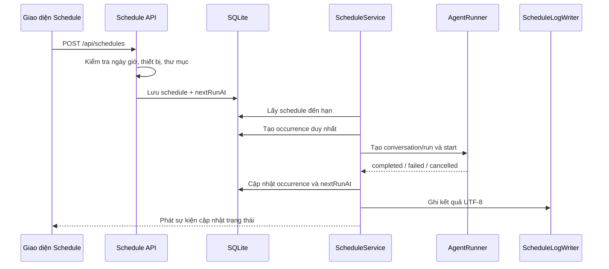

# Kế hoạch thêm tính năng chạy tác vụ theo lịch

## 1. Mục tiêu

Thêm khả năng tạo lịch để Android Agent tự động chạy một câu prompt trên thiết bị đã chọn, vào ngày giờ xác định, lặp lại theo số ngày cấu hình và ghi kết quả ra thư mục log trên máy chạy server.

Mỗi schedule gồm năm trường bắt buộc:

1. Ngày bắt đầu và giờ chạy.
2. Số ngày lặp lại.
3. Câu prompt.
4. Thiết bị Android.
5. Thư mục ghi log.

Tính năng phải dùng chung `AgentRunner`, khóa thiết bị và SQLite hiện có; không tạo một vòng điều khiển Android thứ hai.

## 2. Quy ước nghiệp vụ

### 2.1. Ý nghĩa số ngày lặp lại

Trong MVP, `repeatDays = N` nghĩa là chạy mỗi ngày một lần, cùng giờ, trong N ngày liên tiếp và **tính cả ngày bắt đầu**.

Ví dụ:

- Ngày bắt đầu: `2026-09-08`.
- Giờ chạy: `08:00`.
- Số ngày lặp lại: `3`.
- Các lần chạy: `08/09 08:00`, `09/09 08:00`, `10/09 08:00`.

Giới hạn đề xuất: từ 1 đến 365 ngày. Sau lần cuối, schedule tự chuyển sang `completed`.

### 2.2. Múi giờ

- Mặc định lấy múi giờ của server; cấu hình mặc định hiện tại là `Asia/Bangkok`.
- Lưu tên múi giờ IANA vào từng schedule để lịch không thay đổi nếu cấu hình server đổi.
- Lưu `nextRunAt` và thời điểm occurrence theo UTC trong SQLite.
- UI luôn hiển thị lại theo múi giờ của schedule.

### 2.3. Conversation và run

- Mỗi lần schedule được kích hoạt tạo một conversation mới để lịch sử của các ngày không bị trộn.
- Tiêu đề gợi ý: `[Lịch] <tên schedule> · YYYY-MM-DD HH:mm`.
- Tạo `RunRecord` bằng service nội bộ dùng chung với API chạy thủ công.
- Một thiết bị vẫn chỉ có tối đa một run hoạt động tại một thời điểm.

### 2.4. Trạng thái schedule

```ts
type ScheduleStatus = "active" | "paused" | "completed" | "disabled";
type OccurrenceStatus =
  | "pending"
  | "waiting_device"
  | "running"
  | "completed"
  | "failed"
  | "missed"
  | "cancelled";
```

- `active`: còn lần chạy trong tương lai.
- `paused`: tạm dừng, không phát sinh run mới.
- `completed`: đã chạy hoặc xử lý đủ `repeatDays`.
- `disabled`: bị vô hiệu hóa do cấu hình không còn hợp lệ, ví dụ thư mục log không ghi được nhiều lần liên tiếp.

## 3. Luồng hoạt động



Trình tự khi đến hạn:

1. `ScheduleService` lấy các schedule `active` có `nextRunAt <= now`.
2. Tạo một occurrence trong transaction với khóa duy nhất `(schedule_id, scheduled_for)`.
3. Kiểm tra thiết bị còn tồn tại và có trạng thái `device`.
4. Nếu thiết bị rảnh, tạo conversation và run rồi gọi `AgentRunner.start()`.
5. Nếu thiết bị bận, occurrence chuyển sang `waiting_device` trong khoảng grace period cố định.
6. Nhận sự kiện terminal từ `AgentRunner`, cập nhật kết quả và ghi log.
7. Tính lần chạy kế tiếp; đủ số ngày thì chuyển schedule sang `completed`.

## 4. Thiết kế dữ liệu

Thêm hai bảng bằng migration idempotent trong `SessionRepository` hoặc tách thành `ScheduleRepository` dùng chung connection SQLite.

```sql
CREATE TABLE schedules (
  id TEXT PRIMARY KEY,
  name TEXT NOT NULL,
  start_date TEXT NOT NULL,
  local_time TEXT NOT NULL,
  timezone TEXT NOT NULL,
  repeat_days INTEGER NOT NULL,
  prompt TEXT NOT NULL,
  device_serial TEXT NOT NULL,
  log_directory TEXT NOT NULL,
  status TEXT NOT NULL,
  next_run_at TEXT,
  completed_occurrences INTEGER NOT NULL DEFAULT 0,
  created_at TEXT NOT NULL,
  updated_at TEXT NOT NULL
);

CREATE INDEX idx_schedules_due
ON schedules(status, next_run_at);

CREATE TABLE schedule_occurrences (
  id TEXT PRIMARY KEY,
  schedule_id TEXT NOT NULL REFERENCES schedules(id) ON DELETE CASCADE,
  scheduled_for TEXT NOT NULL,
  status TEXT NOT NULL,
  conversation_id TEXT REFERENCES conversations(id) ON DELETE SET NULL,
  run_id TEXT REFERENCES runs(id) ON DELETE SET NULL,
  started_at TEXT,
  ended_at TEXT,
  result TEXT,
  error_code TEXT,
  error_message TEXT,
  log_file TEXT,
  created_at TEXT NOT NULL,
  updated_at TEXT NOT NULL,
  UNIQUE(schedule_id, scheduled_for)
);
```

Các kiểu dữ liệu TypeScript cần bổ sung trong `lib/contracts/types.ts`:

```ts
type Schedule = {
  id: string;
  name: string;
  startDate: string;       // YYYY-MM-DD
  localTime: string;       // HH:mm
  timezone: string;        // Asia/Bangkok
  repeatDays: number;
  prompt: string;
  deviceSerial: string;
  logDirectory: string;
  status: ScheduleStatus;
  nextRunAt: string | null;
  completedOccurrences: number;
  createdAt: string;
  updatedAt: string;
};
```

Không đặt API key hoặc secret cấu hình model trong bảng schedule. Lưu ý prompt hiện được lưu trong SQLite và có thể chứa thông tin đăng nhập; tài liệu UI cần cảnh báo người dùng không đưa bí mật dài hạn vào prompt nếu không cần thiết.

## 5. Validation

### 5.1. Ngày giờ

- `startDate`: đúng định dạng `YYYY-MM-DD` và là ngày thực tế.
- `localTime`: đúng định dạng 24 giờ `HH:mm`.
- `timezone`: nằm trong danh sách múi giờ được runtime hỗ trợ.
- Không cho tạo mới lịch bắt đầu trong quá khứ; cho phép sai lệch tối đa 60 giây để tránh lỗi khi submit sát phút chạy.
- `repeatDays`: số nguyên từ 1 đến 365.

### 5.2. Prompt

- Trim khoảng trắng.
- Tối thiểu 1 ký tự, tối đa 10.000 ký tự cho schedule.
- Khi tạo run vẫn áp dụng giới hạn và quy tắc an toàn của agent.

### 5.3. Thiết bị

- UI chọn từ danh sách `GET /api/devices` đã tải thủ công.
- Khi tạo hoặc sửa schedule, serial phải tồn tại; có thể chấp nhận thiết bị đang offline nếu serial đã từng được biết đến, nhưng UI phải cảnh báo.
- Khi đến giờ chạy, luôn kiểm tra lại bằng `DeviceManager.requireConnected()`.

Để hỗ trợ chọn thiết bị offline đã cấu hình trước đó, phase đầu có thể chỉ cho chọn thiết bị đang kết nối; phase sau thêm bảng thiết bị đã biết.

### 5.4. Thư mục log

- Chỉ chấp nhận đường dẫn tuyệt đối trên máy server.
- Chuẩn hóa bằng `path.resolve()` và từ chối ký tự null.
- Không ghép tên file do người dùng cung cấp vào đường dẫn.
- Kiểm tra hoặc tạo thư mục bằng API server-side, sau đó kiểm tra quyền ghi bằng một file tạm có tên ngẫu nhiên.
- Không dùng shell để tạo thư mục hoặc ghi log.
- Không trả nội dung file hệ thống tùy ý về frontend.

## 6. Ghi log

Thêm `ScheduleLogWriter` chạy phía server.

Tên file mặc định:

```text
schedule_<8-ký-tự-id>_YYYYMMDD.txt
```

Một file chứa kết quả của schedule trong ngày tương ứng. Ghi nối tiếp UTF-8 với các trường:

```text
[2026-09-08T08:00:00+07:00]
Schedule: Chấm công Humax
Occurrence: <uuid>
Device: QV770X1KE9
Scheduled for: 2026-09-08T08:00:00+07:00
Started at: ...
Ended at: ...
Status: completed
Prompt: ...
Result: ...
Error: ...
Run ID: ...
Conversation ID: ...
---
```

Yêu cầu triển khai:

- Tạo thư mục nếu chưa tồn tại và người dùng có quyền.
- Ghi file theo cơ chế append; serialize thao tác ghi theo đường dẫn để tránh hai occurrence ghi đè nhau.
- Redact chuỗi giống API key và dữ liệu ảnh base64 bằng utility logging hiện có.
- Lỗi ghi log không được làm mất kết quả run trong SQLite. Occurrence giữ trạng thái run và thêm mã lỗi `LOG_WRITE_FAILED` riêng.
- UI hiển thị đường dẫn file log cuối cùng nhưng không hiển thị nội dung secret đã redact.

## 7. ScheduleService

Tạo các thành phần:

```text
lib/server/schedule/
├── schedule-service.ts
├── schedule-repository.ts
├── schedule-calculator.ts
├── schedule-log-writer.ts
└── schedule-validation.ts
```

### 7.1. Vòng quét

- Khởi động `ScheduleService` trong `server.ts` sau khi Next.js và repository sẵn sàng.
- Dùng một timer server-side, ví dụ mỗi 15 giây; đây không phải polling API từ trình duyệt.
- Timer chỉ truy vấn index `idx_schedules_due` và không gọi ADB nếu chưa có lịch đến hạn.
- Có cờ chống hai tick chạy chồng trong cùng tiến trình.
- Dừng timer trong luồng shutdown hiện có.

### 7.2. Chống chạy trùng

- Tạo occurrence trong SQLite transaction trước khi tạo run.
- Unique constraint `(schedule_id, scheduled_for)` là lớp bảo vệ cuối cùng.
- Khi tick lại hoặc server restart, occurrence đã tồn tại không được tạo run thứ hai.
- Việc cập nhật `nextRunAt` và occurrence phải nằm trong transaction hợp lý.

### 7.3. Thiết bị offline hoặc bận

MVP đề xuất:

- Thiết bị offline: đánh dấu occurrence `failed` với `DEVICE_UNAVAILABLE`, ghi log và chuyển sang ngày tiếp theo.
- Thiết bị bận: chuyển `waiting_device`, thử lại trong grace period 10 phút.
- Hết grace period: đánh dấu `failed` với `DEVICE_BUSY_TIMEOUT`.
- Không hủy run thủ công đang chạy để nhường schedule.

Các khoảng retry/grace period nên là cấu hình server ở phase sau, không làm phức tạp form MVP.

### 7.4. Restart và missed run

- Khi server khởi động, reconcile occurrence `running` với trạng thái run trong database.
- Schedule đến hạn trong vòng 15 phút được phép chạy bù một lần.
- Lịch quá hạn hơn 15 phút được ghi occurrence `missed`, ghi log và tính lịch kế tiếp.
- Nếu ứng dụng cần bảo đảm chạy sau khi Windows reboot, phải cài server thành Windows Service hoặc Scheduled Task; timer trong Node chỉ hoạt động khi tiến trình đang chạy.

## 8. API

| Method | Endpoint | Chức năng |
|---|---|---|
| `GET` | `/api/schedules` | Danh sách schedule và trạng thái gần nhất |
| `POST` | `/api/schedules` | Tạo schedule |
| `GET` | `/api/schedules/:id` | Chi tiết schedule và occurrence |
| `PATCH` | `/api/schedules/:id` | Sửa schedule chưa chạy xong |
| `DELETE` | `/api/schedules/:id` | Xóa schedule; không xóa conversation/run đã tạo |
| `POST` | `/api/schedules/:id/pause` | Tạm dừng schedule |
| `POST` | `/api/schedules/:id/resume` | Tiếp tục và tính lại lần chạy kế tiếp |
| `POST` | `/api/schedules/:id/run-now` | Chạy thử ngay, không tính vào `repeatDays` |
| `POST` | `/api/schedules/validate-log-directory` | Kiểm tra/tạo thư mục và quyền ghi |

Tất cả endpoint thay đổi dữ liệu phải dùng `localRequestGuard`, Zod schema strict và `safeError`. API không nhận lệnh shell hoặc tên file tùy ý.

Ví dụ request tạo schedule:

```json
{
  "name": "Quiz My Tasco",
  "startDate": "2026-09-08",
  "localTime": "08:00",
  "timezone": "Asia/Bangkok",
  "repeatDays": 7,
  "prompt": "Mở My Tasco và thực hiện bài quiz...",
  "deviceSerial": "QV770X1KE9",
  "logDirectory": "C:\\hungnm\\automation-script\\mytasco_quiz\\logs"
}
```

## 9. Giao diện

### 9.1. Điều hướng

Thêm nút `Lịch chạy` trong sidebar, bên dưới nút `Cuộc trò chuyện mới`. Khi mở, vùng chat giữa chuyển sang màn hình quản lý schedule; khu vực thiết bị bên phải vẫn hiển thị để người dùng kiểm tra serial.

### 9.2. Form tạo/sửa schedule

Các control:

- `Tên lịch`: tự sinh từ dòng đầu của prompt nhưng cho phép sửa.
- `Ngày bắt đầu`: date picker.
- `Giờ chạy`: time picker 24 giờ.
- `Số ngày lặp lại`: number input, kèm preview danh sách ngày đầu/cuối.
- `Câu prompt`: textarea lớn.
- `Thiết bị`: combobox gồm display name, serial và trạng thái.
- `Thư mục ghi log`: text input và nút `Kiểm tra thư mục`.
- Nút `Lưu lịch`, `Hủy` và tùy chọn `Chạy thử ngay` sau khi lưu.

Không dùng nút chọn folder của browser trong MVP vì browser không thể tin cậy trả đường dẫn filesystem thực cho server. Người dùng nhập hoặc dán đường dẫn Windows, server chịu trách nhiệm validation.

### 9.3. Danh sách schedule

Mỗi dòng hiển thị:

- Tên lịch và trạng thái.
- Thiết bị.
- Lần chạy kế tiếp theo múi giờ.
- Tiến độ, ví dụ `3/7 ngày`.
- Đường dẫn log.
- Hành động `Sửa`, `Tạm dừng/Tiếp tục`, `Chạy ngay`, `Xóa`.

Thêm badge và spinner cho occurrence đang chạy. UI nhận cập nhật qua SSE hoặc event bus hiện có, không polling liên tục `/api/schedules`.

## 10. Tích hợp AgentRunner

Hiện API tạo run đang chứa trực tiếp logic kiểm tra thiết bị, tạo run, gọi `AgentRunner.start()` và thêm message. Cần tách logic này thành service dùng chung, ví dụ:

```ts
runService.createAndStart({
  conversationId,
  deviceSerial,
  goal,
  maxSteps,
  source: "manual" | "schedule",
  scheduleOccurrenceId?: string
});
```

Route handler và `ScheduleService` cùng gọi service này để tránh khác biệt hành vi.

`AgentRunner` hoặc event bus cần cung cấp sự kiện terminal ổn định:

- `run.completed`
- `run.failed`
- `run.cancelled`

`ScheduleService` subscribe các sự kiện trên, tra occurrence theo `runId`, cập nhật database và gọi `ScheduleLogWriter`. Khi restart, bước reconcile dùng trạng thái bền vững trong SQLite thay vì phụ thuộc sự kiện RAM.

## 11. Quan hệ với xóa lịch sử

- `Xóa lịch sử` hiện xóa conversations/runs nhưng không nên xóa cấu hình schedule.
- Với foreign key `ON DELETE SET NULL`, occurrence vẫn giữ kết quả, error và file log dù conversation/run đã bị xóa.
- Xóa một schedule sẽ xóa occurrence của schedule đó nhưng không xóa các conversation/run đã được tạo và không xóa file log trên ổ đĩa.
- Nếu muốn xóa cả file log, phải là thao tác riêng với cảnh báo rõ; ngoài phạm vi MVP.

## 12. Kiểm thử

### 12.1. Unit test

- Tính đúng N ngày, bao gồm ngày bắt đầu.
- Chuyển local date/time sang UTC đúng theo timezone.
- Schedule chuyển `completed` sau occurrence cuối.
- Validation ngày không hợp lệ, giờ không hợp lệ, `repeatDays` ngoài giới hạn.
- Validation đường dẫn tương đối, ký tự null và thư mục không ghi được.
- Tên file log không có path traversal.
- Redaction secret trước khi ghi log.
- Không tạo occurrence trùng khi tick nhiều lần.

### 12.2. Integration test

- Schedule đến hạn tạo đúng một conversation và một run.
- Hai schedule cùng thiết bị không chạy đồng thời.
- Thiết bị offline tạo kết quả lỗi và vẫn tính lịch ngày tiếp theo.
- Pause/resume không làm mất hoặc nhân đôi `nextRunAt`.
- Restart reconcile occurrence đang chạy.
- Xóa lịch sử conversation không làm hỏng schedule/occurrence.
- Test dùng fake clock và SQLite `:memory:`; tuyệt đối không ghi vào `data/app.db` thật.

### 12.3. Kiểm thử thủ công Windows

- Tạo lịch chạy sau thời điểm hiện tại 2–3 phút.
- Xác nhận đúng thiết bị được điều khiển.
- Xác nhận UI cập nhật `running` mà không reload trang.
- Xác nhận file log xuất hiện đúng thư mục và đúng encoding tiếng Việt.
- Tắt server trước giờ chạy, mở lại trong grace period và xác nhận chỉ chạy bù một lần.
- Thử thư mục không có quyền ghi và xác nhận lỗi rõ ràng.

## 13. Các giai đoạn triển khai

### Phase 1 — Dữ liệu và tính lịch

- Thêm contracts, Zod schemas và migration.
- Viết `ScheduleRepository` và `schedule-calculator` với fake clock.
- Hoàn thành unit test tính ngày, timezone và idempotency.

### Phase 2 — Scheduler và AgentRunner

- Tách `RunService` dùng chung.
- Thêm `ScheduleService`, tick server-side và lifecycle start/stop trong `server.ts`.
- Xử lý thiết bị offline/bận, missed run và restart reconciliation.

### Phase 3 — Ghi log

- Thêm validation thư mục và `ScheduleLogWriter`.
- Ghi kết quả terminal, redact secret và lưu `logFile` vào occurrence.
- Kiểm thử Windows path và quyền ghi.

### Phase 4 — API và UI

- Thêm route handlers quản lý schedule.
- Thêm màn hình danh sách, form tạo/sửa, pause/resume/run-now.
- Phát trạng thái realtime bằng SSE/event bus.

### Phase 5 — Hardening

- Kiểm thử restart, chạy trùng và nhiều schedule cùng giờ.
- Thêm retention cho occurrences nếu cần.
- Cập nhật tài liệu setup Windows Service/Scheduled Task.
- Chạy typecheck, test, build và checklist thiết bị thật.

## 14. Tiêu chí hoàn thành

Tính năng được coi là hoàn thành khi:

- Người dùng tạo được schedule với đủ năm trường yêu cầu.
- Preview ngày chạy khớp quy ước `repeatDays`.
- Schedule vẫn tồn tại và chạy đúng sau khi reload UI hoặc restart server.
- Mỗi occurrence chỉ tạo tối đa một run.
- Run dùng đúng serial và không tranh chấp với run khác trên cùng thiết bị.
- Kết quả thành công/thất bại được ghi vào SQLite và thư mục log đã chọn.
- UI hiển thị lần chạy kế tiếp, tiến độ số ngày và trạng thái gần nhất.
- Có thể sửa, pause, resume và xóa schedule an toàn.
- Không polling API liên tục từ trình duyệt.
- Test không chạm vào database hoặc thư mục log thật của người dùng.

## 15. Phần ngoài phạm vi MVP

- Lặp theo thứ trong tuần, cron expression hoặc nhiều khung giờ trong ngày.
- Chạy vô hạn không có ngày kết thúc.
- Gửi email/Telegram sau khi chạy.
- Quản lý secret riêng cho từng schedule.
- Chọn folder bằng native Windows dialog.
- Chạy schedule khi tiến trình server đã tắt mà không có Windows Service/Scheduled Task.
